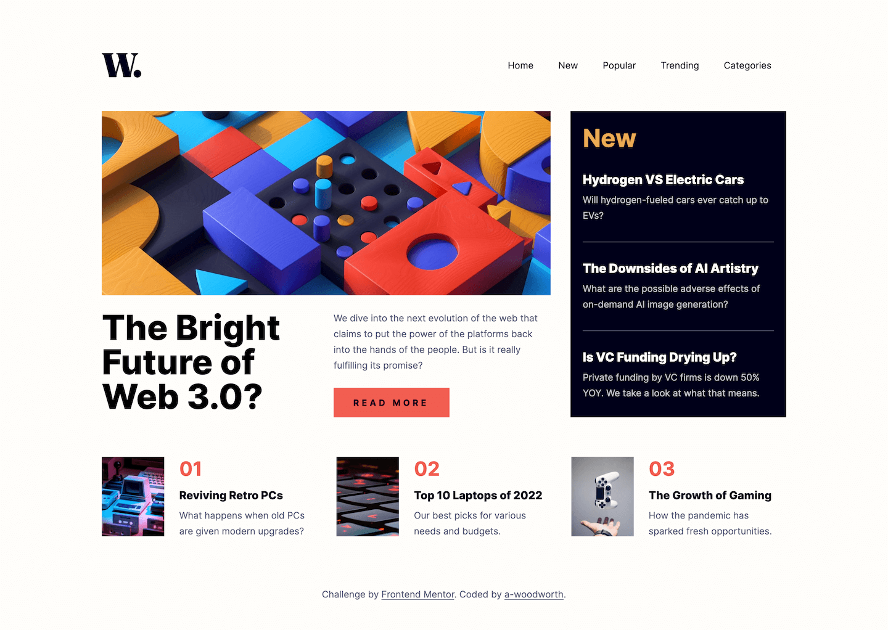

# Frontend Mentor - News homepage solution

This is a solution to the [News homepage challenge on Frontend Mentor](https://www.frontendmentor.io/challenges/news-homepage-H6SWTa1MFl).

## Table of contents

- [Overview](#overview)
  - [The challenge](#the-challenge)
  - [Screenshots](#screenshots)
  - [Links](#links)
  - [Built with](#built-with)
  - [Useful resources](#useful-resources)

## Overview

### The challenge

Users should be able to:

- View the optimal layout for the interface depending on their device's screen size
- See hover and focus states for all interactive elements on the page

### Screenshots

**Desktop**

**Mobile**

### Links

- Solution URL: [Solution]()
- Live Site URL: [Live Site](https://a-woodworth.github.io/news_homepage)

### Built with

- Semantic HTML5 markup
- CSS Custom properties (variables)
- JavaScript
- [Sass](https://sass-lang.com) - CSS Preprocessor

### Useful Resources

- Manuel Matuzović: [Building the main navigation for a website](https://web.dev/articles/website-navigation)
- Video by Coder Coder: [How to build an accessible hamburger menu with HTML, SCSS & JS](https://youtu.be/pBv7igaxfQE?si=kvDK7A-zzzujZOky)
